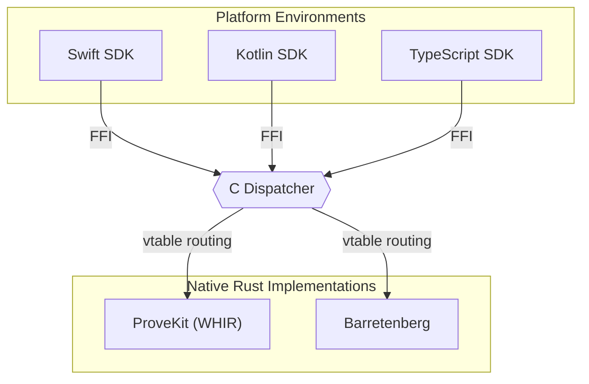

# Verity

[](https://github.com/atheonxyz/verity/actions/workflows/ci.yml)
[](https://github.com/atheonxyz/verity/actions/workflows/security.yml)
[](https://github.com/atheonxyz/verity/releases)
[](LICENSE)

Verity is a multi-platform zero-knowledge proof execution engine. It provides a unified, highly optimized interface to interact with multiple cryptographic proving backends across iOS, Android, and web environments, allowing applications to securely generate and verify proofs natively on client devices.

## Overview

Integrating zero-knowledge proofs into client applications typically requires managing fragmented native libraries, complex build systems, and disparate APIs. Verity solves this by abstracting the proving infrastructure behind a single interface. 

By utilizing an efficient C dispatcher communicating via a stable Foreign Function Interface (FFI) with static Rust libraries, Verity allows you to seamlessly interchange underlying cryptographic backends (e.g., from ProveKit to Halo2) without altering application code.

### Key Capabilities

* **Unified API Surface:** Consistent `load`, `prove`, and `verify` semantics across Swift, Kotlin, and TypeScript.
* **Pluggable Backends:** Dynamically route calls to selected proving backends. Switch between implementations such as ProveKit, Barretenberg, or others with a single configuration parameter.
* **Production-Optimized Execution:** Thread-safe, cross-boundary memory management, LTO-optimized binaries, and formalized error handling.
* **Offline Circuit Compilation:** Works exclusively with pre-compiled prover and verifier schemes generated by external toolchains (e.g., Noir). The SDK enforces strict separation between circuit definition and runtime execution.

## Installation

### Swift (iOS 15+ / macOS 13+)

Integrate via Swift Package Manager in `Package.swift`:

```swift
dependencies: [
    .package(url: "https://github.com/atheonxyz/verity", from: "0.3.3")
],
targets: [
    .target(name: "MyApp", dependencies: [
        .product(name: "Verity", package: "verity")
    ])
]
```

### Kotlin (Android API 24+)

Add the dependency to your `build.gradle.kts`:

```kotlin
dependencies {
    implementation("xyz.atheon:verity:0.3.0")
}
```

### JavaScript / TypeScript

Install via npm for Node.js or browser environments:

```bash
npm install @atheon/verity
```

## Quick Start

The following examples demonstrate initializing the SDK, loading compiled structures, and executing a proof.

### Swift

```swift
import Verity

let verity = try Verity(backend: .provekit)

let prover = try verity.loadProver(from: "scheme.pkp")
let verifier = try verity.loadVerifier(from: "scheme.pkv")

let witness = Witness(values: ["age": "25", "threshold": "18"])
let proof = try prover.prove(witness: witness)

assert(try verifier.verify(proof: proof))
```

### Kotlin

```kotlin
import xyz.atheon.verity.*

val verity = Verity(Backend.PROVEKIT)
val prover = verity.loadProver("scheme.pkp")
val verifier = verity.loadVerifier("scheme.pkv")

prover.use { p ->
    verifier.use { v ->
        val witness = Witness.of(mapOf("age" to "25", "threshold" to "18"))
        val proof = p.prove(witness)
        assert(v.verify(proof))
    }
}
```

### TypeScript

```typescript
import { Verity, Backend } from "@atheon/verity";

const verity = await Verity.create(Backend.ProveKit);

const prover = await verity.loadProver(proverBytes);
const verifier = await verity.loadVerifier(verifierBytes);

const proof = await verity.prove(prover, { age: "25", threshold: "18" });
if (!await verity.verify(verifier, proof)) {
    throw new Error("Proof generation failed");
}
```

## System Architecture

The core of Verity relies on a zero-overhead router that sits between dynamic platform environments and static cryptographic binaries.



For a comprehensive diagram and technical breakdown of internal memory models and bridging operations, consult the [Architecture Documentation](docs/architecture.md).

## Supported Operations

| Target Backend | Internal Library | Current Status | Setup Scheme | Proof Scale |
| :--- | :--- | :--- | :--- | :--- |
| **ProveKit** | WHIR | Stable | Transparent | Variable (~KB) |
| **Barretenberg** | UltraHonk | Active Development | Universal | Fixed (~KB) |
| **SP1** / **Jolt** | zkVM Implementations | Planned | Transparent | Large |
| **Halo2** | Plonk | Planned | Universal | Small |

## Documentation Directory

* **[Architecture](docs/architecture.md)**: Design principles of the C dispatcher and ABI interfaces.
* **[Building & Testing](docs/building.md)**: Steps to compile the framework locally across toolchains.
* **[Extending Backends](docs/adding-a-backend.md)**: Integration guide for contributing new zero-knowledge proving mechanisms.
* **[Platform Support](docs/adding-an-sdk.md)**: Guide on expanding Verity to new host environments.
* **[Roadmap](docs/roadmap.md)**: Upcoming architectural milestones, including asynchronous API support.

## Security

Please report potential vulnerabilities directly to [hello@atheon.xyz](mailto:hello@atheon.xyz). Review our [Security Policy](SECURITY.md) for detailed disclosure protocols.

## Status

Verity is in active development. Releases adhere to semantic versioning. 

## License

This project is licensed under the [MIT License](LICENSE).
